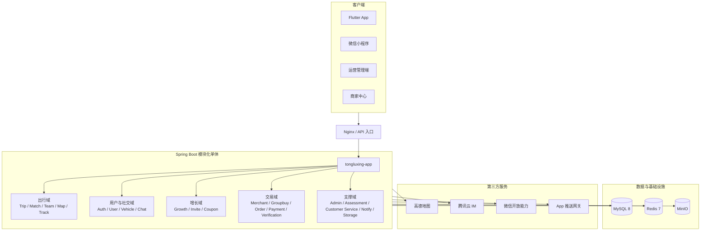
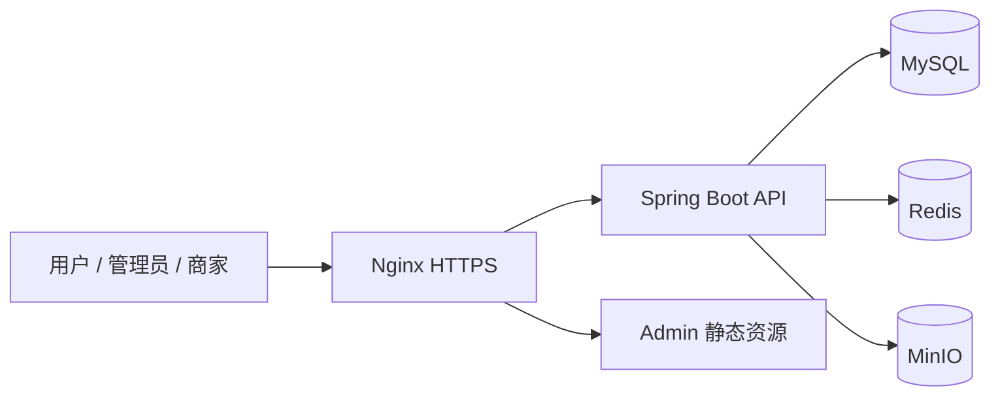

<div align="center">

# 同路行（Tongluxing）

### 面向自驾出行的一站式社交、组队与本地生活服务平台

从发现同路伙伴、规划路线、创建车队和实时协作，到商家优惠、拼团交易、订单核销与运营治理，覆盖自驾出行的完整业务链路。


当前阶段：**内部测试 / 工程化完善中**

</div>

---

## 目录

- [项目简介](#项目简介)
- [核心业务闭环](#核心业务闭环)
- [产品能力](#产品能力)
- [多端组成](#多端组成)
- [系统架构](#系统架构)
- [技术栈](#技术栈)
- [项目结构](#项目结构)
- [后端模块](#后端模块)
- [快速开始](#快速开始)
- [配置说明](#配置说明)
- [开发与验证](#开发与验证)
- [构建与部署](#构建与部署)
- [安全说明](#安全说明)
- [当前状态与限制](#当前状态与限制)
- [参与开发](#参与开发)

## 项目简介

同路行是一个围绕自驾出行打造的多端平台。项目关注的不只是“发布一条行程”，而是将出发前、行驶中和抵达后的关键场景连接起来：

1. 用户完成登录、实名认证和车辆认证；
2. 创建行程，或从附近推荐中寻找同行者；
3. 发起或加入车队，完成成员审批与车辆确认；
4. 在行程中共享位置、记录轨迹、接收偏航和队友距离提醒；
5. 通过私聊与群聊完成同行沟通；
6. 行程结束后结算里程和成长奖励；
7. 通过商家、拼团、优惠券、订单、支付和核销体系完成本地生活消费；
8. 由运营端处理认证、风控、客服、交易和业务规则。

项目采用“**模块化单体后端 + 多客户端**”架构。后端业务边界按 Maven 模块拆分，统一由一个 Spring Boot 应用启动：既保留清晰的领域边界和跨模块契约，也降低当前阶段部署、联调与运维复杂度。

## 核心业务闭环


## 产品能力

### 出行与组队

- 行程草稿、发布、修改、取消和结束
- 起点、终点、途经点与高德路线规划
- 公开行程搜索、附近行程和附近车队
- 基于路线快照的同路推荐与推荐缓存
- 车队创建、入队申请、队长审批、成员移除和退出
- 出发、抵达、继续行程、结束行程等状态流转
- 多成员位置共享、队友距离计算和偏航提醒

### 轨迹与安全

- 行驶轨迹采集、批量上报和弱网离线补传
- 轨迹压缩、有效点比例统计和异常片段识别
- 漂移、跳点、瞬移、异常速度和异常加速度检测
- 行程里程结算与异常轨迹人工审核
- SOS 事件、聊天举报和运营风控入口

### 社交与即时通信

- 用户公开主页、搜索、关注、粉丝和隐私设置
- 私聊和车队群聊
- 文本、图片和位置消息
- 会话列表、未读状态、群成员同步
- 腾讯云 IM UserSig、群组和回调链路

### 用户与车辆

- 短信验证码、密码、微信手机号登录与 Token 刷新
- 用户资料、头像、实名认证和隐私权限
- 多车辆档案、默认车辆、车辆认证和公开车辆卡片
- 认证审核记录与敏感信息加密存储

### 增长体系

- 用户成长账户、成长流水、等级规则和勋章墙
- 邀请码生成、邀请关系绑定和有效邀请统计
- 首次组队等奖励事件的幂等处理
- 优惠券模板、领券、发券、锁券、释放和核销状态

### 商业化闭环

- 商家入驻、资料维护、门店和商品管理
- 商家优惠券池、推广码、奖励池和推广统计
- 拼团创建、参与、成功、失败和运营干预
- 订单试算、创建、查询、取消和超时关闭
- 支付、退款、支付回调和核销后分账
- 核销码生成、扫码解析、确认核销和撤销申请
- 商家月度考核、评分项、等级映射和人工调整

### 运营与服务

- 运营数据总览
- 用户、车辆、商家与合作商审核
- 交易查询、退款审核、拼团干预和补偿任务
- 同行推荐监控、轨迹结算审核和聊天风控
- 客服工单、投诉处理、通知和审计日志
- 成长、邀请、优惠券预算等运营规则配置

## 多端组成

| 客户端 | 目录 | 定位 | 主要技术 |
| --- | --- | --- | --- |
| Flutter App | `tongluxing-frontend-flutter` | 面向自驾用户的主要移动端 | Flutter、Provider、高德地图、腾讯云 IM |
| 微信小程序 | `tongluxing-frontend-wx` | 微信生态内的轻量用户入口 | TypeScript、Less、微信小程序原生框架 |
| 运营管理端 | `tongluxing-frontend-admin` | 审核、风控、交易和平台运营 | Vue 3、Vue Router、Vite |
| 商家中心 | `tongluxing-frontend-merchant` | 商家经营、商品、订单与核销 | Vue 3、Vue Router、Vite |
| 后端服务 | `tongluxing-backend` | 为全部客户端提供统一 API | Spring Boot、MyBatis、MySQL、Redis |

## 系统架构



### 核心设计原则

- **模块拥有自己的数据**：业务表、状态机和数据修改逻辑由所属模块负责。
- **禁止跨模块访问 Mapper**：跨模块协作通过 Service、Facade 或应用层适配器完成。
- **统一应用入口**：`tongluxing-app` 聚合全部模块、Mapper 扫描、定时任务和跨模块适配器。
- **统一接口约定**：公共返回体、错误码、异常处理和基础实体位于 `tongluxing-common`。
- **幂等优先**：邀请奖励、成长发放、通知、支付回调和补偿任务均以业务幂等号约束重复执行。
- **真实服务联调**：App 运行时连接真实后端，聊天链路使用真实腾讯云 IM，不保留运行时 Mock 通道。

## 技术栈

### 后端

| 技术 | 用途 |
| --- | --- |
| Java 21 | 后端语言和运行时 |
| Spring Boot 3.5.14 | Web 应用、配置、依赖管理与 Actuator |
| Spring Security | 登录态校验和接口访问控制 |
| MyBatis Spring Boot 3.0.5 | 数据访问与 XML Mapper |
| Maven | 25 个模块的依赖、测试与构建管理 |
| MySQL 8 | 核心业务数据持久化 |
| Redis 7 | 登录态、缓存、幂等与临时业务数据 |
| MinIO | 图片和业务文件的对象存储 |

### 客户端与 Web

| 技术 | 用途 |
| --- | --- |
| Flutter / Dart | Android、iOS 移动客户端 |
| Provider | Flutter 状态管理 |
| Vue 3.5 / Vue Router 4.5 | 运营端与商家端 |
| Vite 6 | Web 开发服务器与生产构建 |
| TypeScript / Less | 微信小程序逻辑与样式 |
| 高德地图 SDK / Web Service | 地图展示、地点解析和路线规划 |
| 腾讯云 IM | 私聊、群聊和即时消息能力 |

### 工程与运维

- Docker Compose 管理 MySQL、Redis、MinIO 及生产服务编排
- Nginx 提供 API 反向代理和 Admin 静态资源托管
- Spring Boot Actuator 暴露健康状态、指标和 Prometheus 数据
- Maven、Flutter Test 和场景化接口测试用于持续验证

## 项目结构

```text
tongluxing-project/
├─ tongluxing-backend/               # Spring Boot Maven 多模块后端
│  ├─ tongluxing-app/                # 唯一启动应用
│  ├─ tongluxing-common/             # 公共返回、异常、基础实体和工具
│  ├─ auth-module/                   # 认证与 Token
│  ├─ user-module/                   # 用户与实名认证
│  ├─ vehicle-module/                # 车辆与车辆认证
│  ├─ trip-module/                   # 行程与草稿
│  ├─ match-module/                  # 同路推荐
│  ├─ team-module/                   # 车队与成员关系
│  ├─ chat-module/                   # 会话与消息
│  ├─ map-module/                    # 路线与地图数据
│  ├─ driver-track-module/           # 轨迹与行程执行
│  ├─ growth-module/                 # 成长值与勋章
│  ├─ invite-module/                 # 邀请关系与奖励
│  ├─ coupon-module/                 # 券模板与用户券
│  ├─ merchant-module/               # 商家与商品
│  ├─ groupbuy-module/               # 拼团活动
│  ├─ order-module/                  # 订单与补偿任务
│  ├─ payment-module/                # 支付、退款与分账
│  ├─ verification-module/           # 核销与撤销
│  ├─ assessment-module/             # 商家考核
│  ├─ customer-service-module/       # 客服与投诉
│  ├─ notify-module/                 # 通知与投递日志
│  ├─ admin-module/                  # 运营后台聚合能力
│  ├─ storage-module/                # 文件上传与下载签名
│  ├─ database/                      # 重建、迁移和测试数据脚本
│  ├─ performance-test/              # 性能测试脚本、数据与报告
│  ├─ docker-compose.yml             # 本地基础服务编排
│  └─ Dockerfile                     # 后端镜像构建
├─ tongluxing-frontend-flutter/      # Flutter App
├─ tongluxing-frontend-wx/           # 微信小程序
├─ tongluxing-frontend-admin/        # 运营管理端
├─ tongluxing-frontend-merchant/     # 商家中心
└─ README.md
```

## 后端模块

后端父工程共聚合 25 个 Maven 模块。其中 `tongluxing-app` 是统一启动入口，`tongluxing-common` 提供公共基础能力，其余模块按业务领域拆分。

| 领域 | 模块 | 核心职责 |
| --- | --- | --- |
| 基础 | `tongluxing-app` | 应用启动、模块聚合、定时任务、跨模块适配 |
| 基础 | `tongluxing-common` | 公共响应、错误码、异常、基础实体、雪花 ID |
| 账号 | `auth-module` | 短信/密码/微信登录、JWT、刷新、退出和登录日志 |
| 账号 | `user-module` | 用户资料、实名认证、公开主页和隐私设置 |
| 账号 | `vehicle-module` | 车辆档案、默认车辆、车辆认证和公开卡片 |
| 出行 | `trip-module` | 行程、途经点、成员快照、草稿和状态流转 |
| 出行 | `match-module` | 同路评分、路线快照、推荐池和附近推荐 |
| 出行 | `team-module` | 车队、成员、入队申请、审批和退出 |
| 出行 | `map-module` | 路线规划、地点解析、搜索历史和附近地图数据 |
| 出行 | `driver-track-module` | 轨迹上报、弱网补传、异常识别和里程结算 |
| 社交 | `chat-module` | 会话、消息、群成员、腾讯云 IM 与风控 |
| 增长 | `growth-module` | 成长账户、成长流水、等级和勋章 |
| 增长 | `invite-module` | 邀请码、邀请关系、邀请进度和奖励 |
| 增长 | `coupon-module` | 券模板、用户券、领券、锁券和核销结果 |
| 商业 | `merchant-module` | 商家入驻、商品、券池、推广与奖励池 |
| 商业 | `groupbuy-module` | 拼团活动、参与人和过期处理 |
| 商业 | `order-module` | 订单试算、创建、状态流转和补偿任务 |
| 商业 | `payment-module` | 支付、回调、退款和核销后分账 |
| 商业 | `verification-module` | 核销码、扫码核销、撤销和补偿任务 |
| 支撑 | `assessment-module` | 商家评分、月度考核、等级和人工调整 |
| 支撑 | `customer-service-module` | 客服工单、投诉、回复和处理记录 |
| 支撑 | `notify-module` | 通知、未读数、事件投递和投递日志 |
| 支撑 | `admin-module` | 运营审核、配置、查询、干预和审计 |
| 支撑 | `storage-module` | 文件记录、上传确认和下载预签名 |

## 快速开始

### 1. 环境要求

| 工具 | 建议版本或要求 |
| --- | --- |
| JDK | 21 |
| Maven | 3.9+ |
| Docker | Docker Desktop，使用 Linux containers |
| Node.js | 20 LTS 或兼容 Vite 6 的版本 |
| Flutter | 支持 Dart `^3.12.2` 的版本 |
| Android | Android Studio / Android SDK / ADB |
| 小程序 | 微信开发者工具 |

### 2. 获取代码

```bash
git clone https://github.com/taxidriver4ever/tongdao-project.git
cd tongdao-project
```

> 远程仓库名称目前仍为 `tongdao-project`，源码与产品统一使用“同路行 / Tongluxing”作为项目名称。

### 3. 启动基础服务

后端目录提供 MySQL、Redis 和 MinIO 的 Docker Compose 配置：

```powershell
cd .\tongluxing-backend
docker compose --env-file .env up -d
docker compose ps
```

默认本地端口：

| 服务 | 地址或端口 |
| --- | --- |
| Spring Boot API | `http://127.0.0.1:18080/api` |
| MySQL | `127.0.0.1:3306` |
| Redis | `127.0.0.1:6379` |
| MinIO API | `http://127.0.0.1:19000` |
| MinIO Console | `http://127.0.0.1:19001` |
| Admin | `http://127.0.0.1:5174/admin/` |
| Merchant | `http://127.0.0.1:5175` |

### 4. 配置后端

项目使用 Spring Profile 与环境变量管理配置：

```text
tongluxing-backend/
├─ .env
├─ .env.local
├─ .env.prod
└─ tongluxing-app/src/main/resources/
   ├─ application.yml
   ├─ application-local.yml
   └─ application-prod.yml
```

本地启动前请确认以下配置可用：

- MySQL、Redis 和 MinIO 连接信息；
- JWT 与用户、车辆、商家数据加密密钥；
- 腾讯云 IM App ID、Secret Key 和管理员账号；
- 使用地图能力时配置高德 Web Service Key；
- 使用微信登录时配置微信小程序 App ID 与 Secret。

### 5. 启动后端

```powershell
cd .\tongluxing-backend
mvn -pl tongluxing-app -am spring-boot:run
```

明确指定本地 Profile：

```powershell
$env:SPRING_PROFILES_ACTIVE = 'local'
mvn -pl tongluxing-app -am spring-boot:run
```

检查服务状态：

```powershell
curl.exe http://127.0.0.1:18080/api/health
curl.exe http://127.0.0.1:18080/api/actuator/health
```

> 当前开发配置启用了 `spring.sql.init.mode=always`。应用启动时会加载各模块 Schema 与迁移 SQL；连接共享或生产数据库前务必审查执行影响并完成备份。

### 6. 启动运营管理端

```powershell
cd .\tongluxing-frontend-admin
npm install
npm run dev
```

默认地址为 `http://127.0.0.1:5174/admin/`，`/api` 请求代理到本地后端。可通过 `VITE_DEV_PROXY_TARGET` 覆盖代理目标。

### 7. 启动商家中心

```powershell
cd .\tongluxing-frontend-merchant
npm install
npm run dev
```

默认地址为 `http://127.0.0.1:5175`。商家端与 App 共用手机号密码，账号通过商家入驻审核后才能进入工作台。

### 8. 启动 Flutter App

```powershell
cd .\tongluxing-frontend-flutter
flutter pub get
flutter run
```

Android 模拟器访问宿主机后端：

```powershell
flutter run -d emulator-5554 --dart-define=API_BASE_URL=http://10.0.2.2:18080/api
```

USB 真机可使用项目提供的脚本建立 `adb reverse`：

```powershell
.\run_android_usb.ps1 -DeviceId <设备序列号>
```

Windows 下 Android 构建工具可能无法稳定处理包含中文的绝对路径。遇到相关问题时，请参考 [Flutter 客户端说明](./tongluxing-frontend-flutter/README.md)，从纯英文目录联接运行。

### 9. 启动微信小程序

```powershell
cd .\tongluxing-frontend-wx
npm install
```

使用微信开发者工具导入该目录，然后执行“工具 → 构建 npm”。小程序没有命令行启动脚本，还需要配置 App ID、请求合法域名和腾讯云 IM 依赖。

## 配置说明

### 常用环境变量

| 分类 | 环境变量 |
| --- | --- |
| 应用 | `SERVER_PORT`、`SERVER_SERVLET_CONTEXT_PATH`、`SPRING_PROFILES_ACTIVE` |
| MySQL | `MYSQL_URL`、`MYSQL_DATABASE`、`MYSQL_USERNAME`、`MYSQL_PASSWORD` |
| Redis | `REDIS_HOST`、`REDIS_PORT`、`REDIS_USERNAME`、`REDIS_PASSWORD` |
| MinIO | `MINIO_ENDPOINT`、`MINIO_PUBLIC_ENDPOINT`、`MINIO_ROOT_USER`、`MINIO_ROOT_PASSWORD`、`MINIO_BUCKET` |
| 鉴权 | `AUTH_JWT_SECRET`、`AUTH_JWT_ISSUER`、`AUTH_JWT_ACCESS_EXPIRE_SECONDS` |
| 数据加密 | `USER_DATA_ENCRYPTION_KEY`、`VEHICLE_DATA_ENCRYPTION_KEY`、`MERCHANT_DATA_ENCRYPTION_KEY` |
| 高德地图 | `AMAP_WEB_SERVICE_KEY`、`AMAP_WEB_SERVICE_BASE_URL` |
| 微信 | `WX_MINIAPP_APP_ID`、`WX_MINIAPP_APP_SECRET` |
| 腾讯云 IM | `TENCENT_IM_SDK_APP_ID`、`TENCENT_IM_SECRET_KEY`、`TENCENT_IM_ADMIN_USER_ID`、`TENCENT_IM_CALLBACK_TOKEN` |
| 管理端 | `ADMIN_AUTH_USERNAME`、`ADMIN_AUTH_PASSWORD`、`ADMIN_AUTH_SESSION_EXPIRE_SECONDS` |
| 推送 | `APP_PUSH_GATEWAY_URL`、`APP_PUSH_API_KEY` |

仓库中的本地配置仅用于开发。生产部署必须使用独立强随机密钥、受限数据库账号、HTTPS 地址和安全的秘密管理方案。

### API 约定

- 默认 Context Path：`/api`
- 用户接口主要使用 `/v1/**`
- 模块间调用使用 `/internal/v1/**`
- 运营接口使用 `/v1/admin/**` 或对应后台路径
- 统一返回体、错误码和全局异常处理由 `tongluxing-common` 提供
- 时间格式默认使用 `Asia/Shanghai` 和 `yyyy-MM-dd HH:mm:ss`

## 开发与验证

### 后端

```powershell
cd .\tongluxing-backend

# 全量测试
mvn test

# 编译并打包所有模块
mvn clean package

# 只构建启动应用及其依赖
mvn -pl tongluxing-app -am package -DskipTests
```

### Web

```powershell
cd .\tongluxing-frontend-admin
npm ci
npm run build

cd ..\tongluxing-frontend-merchant
npm ci
npm run build
```

### Flutter

```powershell
cd .\tongluxing-frontend-flutter
flutter analyze
flutter test
flutter build apk --debug
```

### 数据库与测试数据

数据库脚本位于 `tongluxing-backend/database`，包含全量重建、增量迁移、索引和开发测试数据。使用前请先阅读 [数据库说明](./tongluxing-backend/database/README.md)。

典型开发库重建顺序：

```text
01_reset_and_create_all_tables.sql
02_create_test_users.sql
03_mock_recommended_trips.sql
```

> `01_reset_and_create_all_tables.sql` 会删除并重建同路行业务表，只能用于确认过的开发或测试数据库，严禁在生产环境执行。

### 当前验证基线

根据仓库当前交付记录：

- Maven 25 模块构建及 Spring Boot repackage 已通过；
- Admin 的 Vite 生产构建已通过；
- Flutter `analyze`、自动化测试和 release APK 构建已通过；
- 测试资料覆盖 52 个 App 可见功能、358 个正常、异常、边界和权限场景；
- 后端包含单元/集成测试，以及独立的接口和性能测试资料。

这些结果反映当前交付快照，不替代提交代码后的重新测试。

## 构建与部署

### 后端 JAR

```powershell
cd .\tongluxing-backend
mvn clean package
java -jar .\tongluxing-app\target\tongluxing-app-1.0-SNAPSHOT.jar
```

### Docker 镜像

```powershell
cd .\tongluxing-backend
docker build --platform linux/amd64 -t tongluxing-backend:1.0-SNAPSHOT .
```

### Admin 静态资源

```powershell
cd .\tongluxing-frontend-admin
npm ci
npm run build
```

生产构建的 base 为 `/admin/`，部署时需保证 Nginx 对 `/admin/` 和 `/admin/assets/**` 的路由一致。

### Flutter Release

```powershell
cd .\tongluxing-frontend-flutter
flutter build apk --release --dart-define=API_BASE_URL=https://api.example.com/api
```

生产发布前必须配置正式 Android release keystore，并同步维护 `pubspec.yaml` 中的版本号与构建号。

### 生产拓扑建议



生产环境只应公开 HTTP/HTTPS 入口和受限来源的 SSH。MySQL、Redis、Spring Boot 内部端口与 MinIO Console 不应直接暴露到公网。

## 安全说明

- 不要提交 `.env` 中的真实密码、Token、第三方 Secret 和管理员凭据。
- 生产环境必须替换全部本地默认密码和开发用 JWT/加密密钥。
- API 与对象存储应使用 HTTPS，移动端正式版应移除明文 HTTP 例外。
- MySQL、Redis 和 MinIO 管理端口只允许内网访问。
- 上传文件应执行类型、大小、归属与对象 Key 校验。
- 支付和 IM 回调必须验证签名、时间窗口与幂等键。
- 数据库升级前需要备份 MySQL、Redis 持久化数据、MinIO 对象和当前部署配置。
- 不要执行 `docker compose down -v`，除非明确要永久删除全部命名卷数据。

发现安全问题时，请不要在公开 Issue 中提交密钥、个人信息或可直接利用的攻击细节，应通过仓库维护者提供的私密渠道报告。

## 当前状态与限制

项目目前面向内部测试与继续开发，正式生产使用前仍需关注：

- Flutter Android 正式分发需配置独立 release keystore；
- 生产 API、MinIO 和第三方回调需要完成全链路 HTTPS；
- `minio/minio:latest` 应在稳定发布时固定为经过验证的版本或镜像摘要；
- 微信登录、高德地图、腾讯云 IM 和系统推送依赖真实第三方配置；
- 自动 Schema 初始化适合当前开发阶段，生产数据库应改为受控迁移流程；
- 压测和轨迹风控阈值需结合真实路线与设备数据继续校准。

## 子项目说明

- [Flutter App 使用说明](./tongluxing-frontend-flutter/README.md)
- [运营管理端使用说明](./tongluxing-frontend-admin/README.md)
- [商家中心使用说明](./tongluxing-frontend-merchant/README.md)
- [数据库与测试数据说明](./tongluxing-backend/database/README.md)
- [后端性能测试说明](./tongluxing-backend/performance-test/README.md)

## 参与开发

推荐的协作流程：

1. 从主分支创建语义清晰的功能分支；
2. 将修改限制在对应业务模块，避免跨模块直接访问 Mapper；
3. 新增接口时同步补充鉴权、参数校验、错误码和测试；
4. 数据库变更使用可审查、可重复执行的迁移脚本；
5. 提交前执行受影响模块测试，并至少完成对应客户端构建；
6. Pull Request 中说明业务背景、影响范围、验证结果和回滚方式。

建议使用以下提交类型：

```text
feat:     新增功能
fix:      修复缺陷
refactor: 重构且不改变外部行为
test:     增加或调整测试
docs:     文档变更
chore:    构建、工具或依赖维护
```

## License

当前仓库尚未提供开源许可证。在许可证明确之前，代码默认保留全部权利，不应视为允许复制、修改或再分发。如计划公开开源，请由项目所有者补充合适的 `LICENSE` 文件。

---

<div align="center">

**同路而行，让每一段自驾旅程都有人分享。**

</div>
